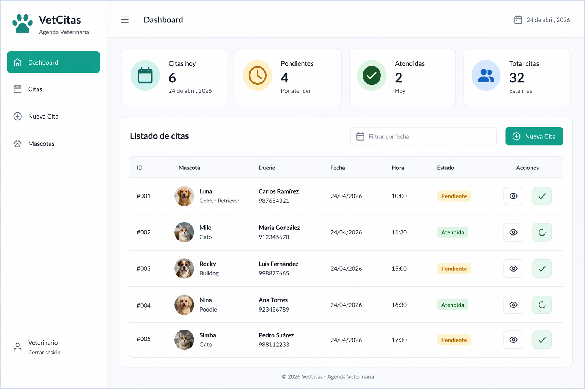

# 🐾 VetCitas — Vet Appointment Manager


---

## 📌 Descripción

**VetCitas** es una aplicación full-stack para la gestión de citas veterinarias.  
Permite crear, listar y administrar citas de manera eficiente, incorporando validaciones de horarios y estados en tiempo real.

Este proyecto demuestra el desarrollo de una arquitectura cliente-servidor utilizando una API REST y una interfaz moderna.

---

## 🚀 Funcionalidades

- 📅 Crear citas veterinarias
- 📋 Listar citas en una tabla interactiva
- 🔄 Cambiar estado: **pendiente → atendida**
- 🔍 Filtrar citas por fecha
- ⛔ Validación de horarios (evita duplicados)
- 🎨 Indicadores visuales de estado

---

## 🧱 Tecnologías

### Frontend

- Vue 3
- Quasar Framework
- Axios

### Backend

- Node.js
- Express.js

---

## 🖼️ Screenshots

### 📊 Dashboard



### ➕ Crear Cita


### 📋 Listado de Citas


> ⚠️ Crea un.a carpeta `/screenshots` y agrega tus imágenes aquí para que se vean en GitHub.

---

## ⚙️ Instalación

### 🔹 Backend

```bash
cd backend
npm install
npm run dev
```

### 🔹 Frontend

```bash
cd frontend
npm install
quasar dev
```

---

## 🔌 API Endpoints

| Método | Endpoint      | Descripción          |
| ------ | ------------- | -------------------- |
| GET    | /citas        | Listar citas         |
| POST   | /citas        | Crear cita           |
| PUT    | /citas/:id    | Marcar como atendida |
| GET    | /citas?fecha= | Filtrar por fecha    |

---

## 📈 Mejoras futuras

- 🔐 Autenticación (JWT)
- 🗄️ Base de datos (MongoDB / MySQL)
- 📊 Dashboard con métricas
- 📱 Responsive mejorado

---

## 👥 Equipo

- **Giselle Cifuentes** — Frontend & Backend
- **Teresa Barrios** — Frontend, Backend & QA

---

## 📄 Licencia

Este proyecto está bajo la licencia MIT.
